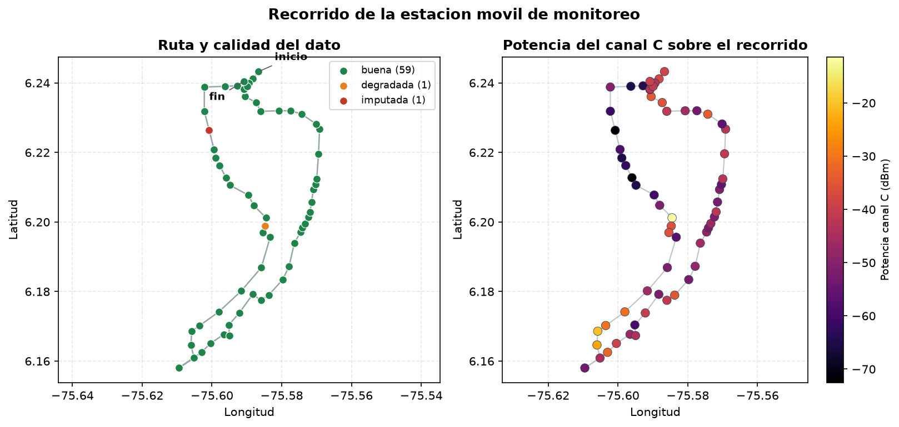
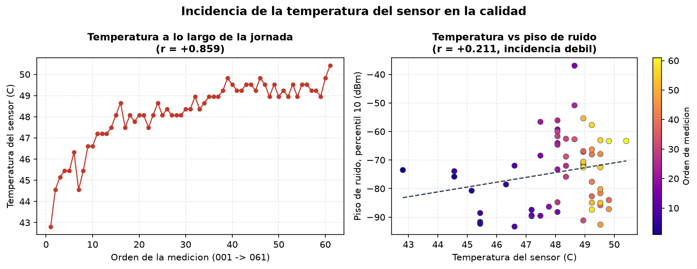
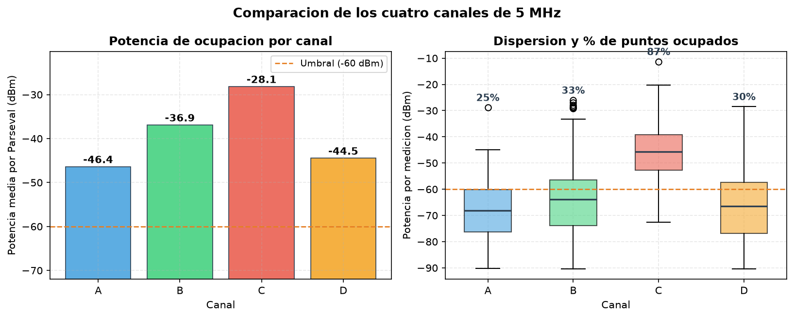
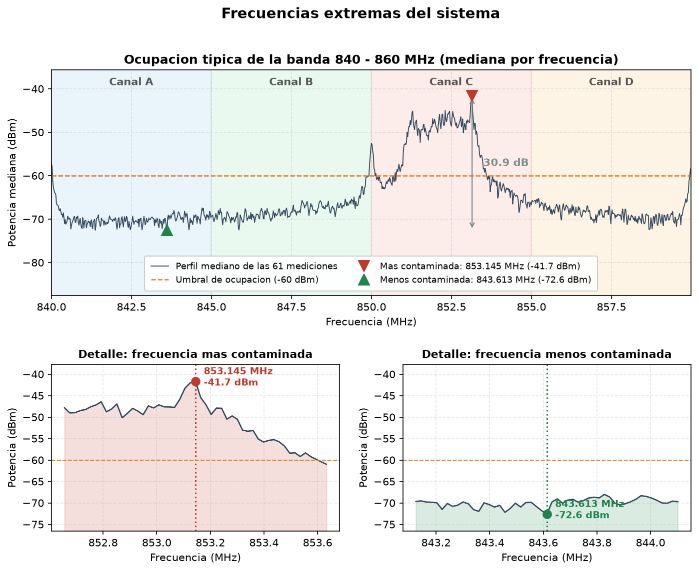

# Ocupación del espectro 840–860 MHz en el occidente de Medellín

## Resumen

Se analizaron 61 mediciones de espectro tomadas por una estación móvil a lo largo de 26.2 km del occidente de Medellín. La banda está contaminada de forma desigual: el canal C (850–855 MHz) supera el umbral de -60 dBm en el 87% del recorrido y no debe asignarse, mientras que el canal A (840–845 MHz) es el más limpio, con ocupación en el 25% de los puntos, y es el recomendado para nuevas asignaciones. La frecuencia más contaminada del sistema es 853.145 MHz y la más limpia 843.613 MHz. Las dos zonas de mayor potencia coinciden con estaciones base celulares verificadas en campo.

## 1. Calidad de los datos

La campaña consta de 61 archivos (001.txt a 061.txt), cada uno con 1029 columnas: 1024 valores de potencia en dBm entre 840 y 860 MHz, a 19.53 kHz por valor, seguidos de temperatura del sensor, longitud, latitud, altura y error de distancia del GPS. Todos tienen la estructura correcta y ninguno de los 62464 valores de potencia es nulo, infinito o está fuera del rango físico del receptor. Se dejaron fuera de la serie tres archivos que no son mediciones del recorrido: medidaprueba.txt y medidapureba2.txt, ensayos del operador con GPS en cero o fuera de la ciudad, y ANTENNA1.csv, la caracterización de la antena.

La auditoría encontró problemas en 3 mediciones; las otras 58 están limpias. El error de distancia del GPS, que se interpreta como HDOP, tiene una mediana de 0.9 en la campaña.

- 008.txt perdió la señal GPS: latitud, longitud y altura llegaron en cero. Su espectro es válido, así que se imputó la posición (sección 2).
- 016.txt tiene el piso de ruido en -37.0 dBm, 35.6 dB por encima del típico de la campaña (-72.6 dBm): no hay ningún tramo de la banda en silencio. Se conserva y se marca como anomalía espectral.
- 017.txt tiene error de distancia 17.3, unas 19 veces el típico. Tiene posición, solo que imprecisa, y es coherente con sus vecinas en la ruta; se conserva como degradada y se excluye únicamente de la estimación de fuentes.

La causa del piso anómalo se verificó en campo. En Google Street View hay una estación base celular (6.201370, -75.584742) a 35 m de 016.txt; ninguna otra medición pasó a menos de 282 m de ella. El receptor operó con ganancia fija de 40 dB, sin control automático, y al pasar al pie de la antena se saturó. Una segunda estación (6.168150, -75.608361) queda a 288 m de 024.txt, la medición con el segundo piso más alto (+21.8 dB): allí la señal es fuerte pero el receptor no llegó a saturarse y la medición es válida.

La medición saturada no se corrige ni se descarta: su posición es correcta y registra un hecho real, un emisor a pocos metros. Pero sus potencias están infladas, así que no se deja que decida los indicadores del sistema: la frecuencia más contaminada se calcula con la mediana entre mediciones (sección 6) y su efecto sobre la potencia media de los canales se reporta aparte (sección 5).

En resumen, de las 61 mediciones 58 quedan como buenas, 1 imputada, 1 degradada y 1 marcada por saturación. Se corrigieron 3 valores, todos de posición; ningún valor de espectro fue modificado.

## 2. Técnicas de imputación

Solo se imputó la posición de 008.txt, por interpolación lineal entre sus vecinas 007.txt y 009.txt. La estación se desplaza de forma continua y los archivos siguen el orden del recorrido, así que el punto perdido está necesariamente en el tramo que une a sus vecinas. La posición imputada es 6.22636, -75.60079 a 1545 m de altura. El error máximo es la mitad de ese tramo, ±0.63 km, del mismo orden que la separación típica entre mediciones consecutivas (0.39 km).

Se eligió la interpolación lineal porque es la que menos supone: descartar la medición perdía un espectro válido, el vecino más cercano ignora que el vehículo se movió, una curva suave supone velocidades que no se conocen y los archivos no traen marca de tiempo para reconstruir la velocidad real.

Las otras dos mediciones con problemas no se imputan. La de HDOP alto tiene una posición real y reemplazarla por un promedio destruiría información. La saturada tampoco admite imputación: sus vecinas en la ruta difieren 21 dB entre sí aun estando a menos de un kilómetro, de modo que un espectro interpolado no representaría lo que había en ese punto.

## 3. Ruta de la estación móvil

El orden de los archivos es el orden del recorrido, lo que permite reconstruir la ruta sin marcas de tiempo. La estación hizo un circuito de 26.2 km: salió del norte del sector (001.txt, 6.24326, -75.58667), bajó hasta el punto más al sur en 027.txt (6.15801, -75.60950) y regresó hacia el norte por un trazado más oriental hasta 061.txt. La altura varió entre 1499 y 1590 m.

*Figura 1. Recorrido con la calidad del dato de cada punto (izquierda) y coloreado por la potencia del canal más contaminado (derecha).*

## 4. Incidencia de la temperatura del sensor

La temperatura del sensor subió de 42.8 a 50.4 °C durante la campaña, casi en línea recta con el avance del recorrido (correlación de +0.86 con el orden de las mediciones). Es el calentamiento del propio equipo, no una variable ambiental. Su relación con la calidad del dato es débil: contra el piso de ruido la correlación es +0.21, compatible con un leve aumento del ruido térmico del receptor, y contra el error del GPS es -0.10, es decir, ninguna. La temperatura no compromete las mediciones y no se descartó ninguna por esta causa.

*Figura 2. Evolución de la temperatura durante la campaña (izquierda) y su relación con el piso de ruido (derecha).*

## 5. Contaminación por canal

La banda se divide en cuatro canales consecutivos de 5 MHz, de 256 valores cada uno. La potencia media de cada canal en cada punto se calcula con la sumatoria de Parseval: los dBm se pasan a mW, se promedian los 256 valores y el resultado vuelve a dBm para compararlo con el umbral de -60 dBm. Promediar los dBm directamente daría la media geométrica y escondería los picos: con ese atajo, 20 de las 244 combinaciones de medición y canal pasarían de ocupadas a libres, y en el peor caso (009.txt, canal D) el error llega a 20 dB. Se usa la potencia media y no la total porque sumar 256 valores añade 24 dB por pura aritmética y dejaría todos los canales por encima del umbral.

| Canal | Banda | Puntos ocupados | Potencia media | Sin la medición saturada |
|---|---|---|---|---|
| A | 840–845 MHz | 15 de 61 (25%) | -46.4 dBm | -58.0 dBm |
| B | 845–850 MHz | 20 de 61 (33%) | -36.9 dBm | -37.6 dBm |
| C | 850–855 MHz | 53 de 61 (87%) | -28.1 dBm | -34.8 dBm |
| D | 855–860 MHz | 18 de 61 (30%) | -44.5 dBm | -48.9 dBm |

El canal C es el más contaminado: supera el umbral en 53 de los 61 puntos y su potencia media es 18.2 dB mayor que la del canal más limpio. El canal A es el menos contaminado, ocupado en 15 puntos. El orden de mayor a menor es C, B, D, A.

La potencia media es un promedio lineal entre puntos, y en ella pesa mucho la medición saturada. Sin ella el canal A baja 11.6 dB, pero el orden de los canales se mantiene y el número de puntos ocupados, que es el criterio de decisión, no depende de ese efecto.

Se descartó que la contaminación del canal C sea un artefacto del receptor. El USRP deja un pequeño pico en su frecuencia central, 850 MHz, justo en la frontera entre B y C; al retirarlo, el canal C pasa de 53 a 52 puntos ocupados y el B se mantiene en 20. El efecto es marginal y el espectro se conserva sin modificar.

*Figura 3. Potencia media de cada canal frente al umbral (izquierda) y dispersión de las 61 mediciones (derecha).*

## 6. Frecuencias más y menos contaminadas

La frecuencia más contaminada de todo el sistema es 853.145 MHz, en el canal C: su potencia mediana es -41.7 dBm y supera el umbral en el 92% del recorrido. No es un valor aislado sino parte de un bloque continuo de unos 1.5 MHz (851.80–853.30 MHz), el ancho típico de una portadora celular. La menos contaminada es 843.613 MHz, en el canal A, con mediana de -72.6 dBm y solo 20% de puntos sobre el umbral. Entre ambas hay 30.9 dB de diferencia.

Para comparar frecuencias entre puntos se usa la mediana y no la media, porque la pregunta es qué frecuencia está contaminada en todo el recorrido y no en un solo lugar. La media la decide la medición saturada, que la llevaría a 851.719 MHz; la mediana señala la misma frecuencia aunque se retire cualquiera de las 61 mediciones (61 de 61 pruebas).

*Figura 4. Potencia mediana de la banda con la frecuencia más y la menos contaminada señaladas, y el detalle de cada una.*

## 7. Recomendación técnica para la ANE

Con base en la ocupación medida en los 61 puntos del recorrido, se recomienda a la Agencia:

- **Canal A (840–845 MHz): priorizarlo para nuevas asignaciones.** Es el más limpio de la banda, ocupado solo en el 25% de los puntos.
- **Canal D (855–860 MHz): utilizable como segunda opción.** Está ocupado en el 30% de los puntos, y todos esos puntos también lo están en el canal B: ambos responden a los mismos emisores, y en el resto del recorrido el canal está libre.
- **Canal B (845–850 MHz): no recomendado para despliegues nuevos sin coordinación.** Está ocupado en el 33% de los puntos, tiene la segunda potencia más alta de la banda y limita con el canal C, con riesgo de interferencia de canal adyacente.
- **Canal C (850–855 MHz): no asignar.** Está ocupado en el 87% del recorrido; cualquier asignación nueva sufriría interferencia en prácticamente toda el área medida.

Dentro del plan, conviene evitar la vecindad de 853.145 MHz y usar 843.613 MHz como referencia de piso de ruido en futuras campañas. El estudio tiene dos límites: cubre 26.2 km del occidente de la ciudad y no es extrapolable al resto del Valle de Aburrá, y son mediciones puntuales a lo largo de un recorrido, que no capturan la variación de la ocupación según la hora.

## 8. Bonificación: origen de la contaminación

El primer intento fue la trilateración: suponer un único emisor cuya potencia cae con el logaritmo de la distancia y buscar, en una malla sobre la ciudad, el punto que mejor explica las 59 mediciones. No funcionó en ningún canal: el mejor ajuste explica el 15% de la variación, lejos del 60% exigido, y en el canal C el ajuste indica que la potencia crecería con la distancia. La razón es que no hay un emisor sino varios, y en este recorrido se identificaron dos estaciones base a 4.5 km una de otra. A eso se suma que la ruta es casi una línea, lo que impide ver la fuente desde ángulos distintos, y que los edificios hacen variar la potencia más de 61 dB entre puntos.

Se usó entonces un estimador más simple: el centro de las 6 mediciones más fuertes de cada canal (el 10% superior), ponderado por su potencia en mW. No localiza una antena, sino la zona desde donde llega la energía dominante. Los centros obtenidos son canal A en 6.20005, -75.58513; canal B en 6.18115, -75.59215; canal C en 6.19512, -75.58824; canal D en 6.19471, -75.58622. El resultado no depende del tamaño del grupo: con entre el 15% y el 50% de las mediciones ningún centro se mueve más de 0.3 km, porque en escala lineal los puntos débiles casi no pesan.

Las estaciones base verificadas en campo validan el método. El centro del canal A queda a 153 m de la antena de Guayabal, prácticamente sobre ella. Los de C y D apuntan a la misma antena, a menos de 0.8 km. El del canal B, en cambio, cae entre las dos antenas, a 2.4 km y 2.3 km de cada una: ese canal recibe energía de ambas y el promedio las mezcla. Es el límite de este método cuando hay más de un emisor.

Para localizar cada emisor con precisión haría falta un recorrido que rodee las zonas de mayor potencia, en lugar de atravesarlas, y una antena directiva que mida desde qué dirección llega la señal.

